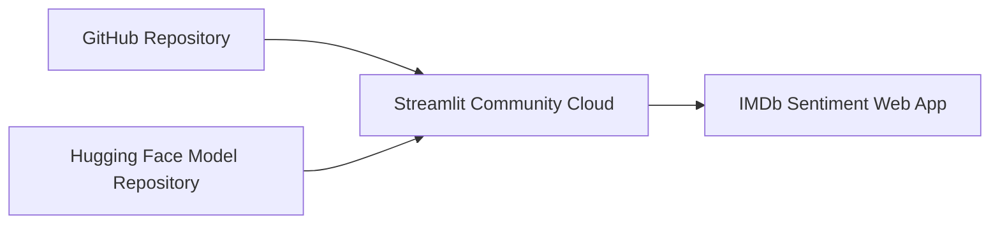

# IMDb Sentiment Analysis with 14 BERT-Family Models

<div align="center">

### Transformer Benchmarking, Explainable Evaluation and ELECTRA Streamlit Deployment

[](https://www.python.org/)
[](https://huggingface.co/docs/transformers/)
[](https://streamlit.io/)
[](https://pytorch.org/)
[](https://www.kaggle.com/datasets/lakshmi25npathi/imdb-dataset-of-50k-movie-reviews)

</div>

## Overview

This project provides a beginner-friendly, end-to-end comparison of **14 BERT-family Transformer models** for binary sentiment classification using the **IMDb Dataset of 50K Movie Reviews**.

The notebook covers dataset loading, preprocessing, exploratory data analysis, word clouds, Transformer fine-tuning, evaluation, model comparison charts, error analysis and automatic packaging of the best model. The best-performing model from the recorded quick-mode experiment, **ELECTRA-base**, is also deployed through an interactive **Streamlit web application**.

> **Important:** The recorded results are from the notebook's quick mode using 4,000 training, 1,000 validation and 1,000 test reviews. They are useful as an educational benchmark but should not be presented as full-dataset research results.

## Project Highlights

- Downloads the public IMDb dataset automatically through KaggleHub.
- Performs light, Transformer-friendly text preprocessing.
- Preserves punctuation, stopwords, word order and letter case when useful.
- Creates stratified training, validation and test partitions.
- Fine-tunes and compares 14 Transformer checkpoints.
- Calculates accuracy, precision, recall, F1-score, ROC-AUC and test loss.
- Generates class-distribution graphs, word clouds and frequent-word charts.
- Produces confusion matrices and learning curves for each completed model.
- Compares performance, runtime and model size through multiple visualizations.
- Reviews high-confidence incorrect predictions for error analysis.
- Automatically saves and packages the best model for deployment.
- Includes a Streamlit application for single-review and batch CSV predictions.

## Models Compared

| No. | Model | Hugging Face checkpoint |
|---:|---|---|
| 1 | BERT-base | `google-bert/bert-base-uncased` |
| 2 | mBERT | `google-bert/bert-base-multilingual-cased` |
| 3 | XLM-RoBERTa-base | `FacebookAI/xlm-roberta-base` |
| 4 | mDeBERTa-v3-base | `microsoft/mdeberta-v3-base` |
| 5 | RemBERT | `google/rembert` |
| 6 | ALBERT-base | `albert/albert-base-v2` |
| 7 | DistilBERT | `distilbert/distilbert-base-uncased` |
| 8 | TinyBERT | `huawei-noah/TinyBERT_General_4L_312D` |
| 9 | DeBERTa-v2 | `microsoft/deberta-v2-xlarge` |
| 10 | ModernBERT-base | `answerdotai/ModernBERT-base` |
| 11 | RoBERTa-base | `FacebookAI/roberta-base` |
| 12 | IndicBERT-v2 | `ai4bharat/IndicBERTv2-MLM-only` |
| 13 | MuRIL | `google/muril-base-cased` |
| 14 | ELECTRA-base | `google/electra-base-discriminator` |

## Dataset

The project uses the [IMDb Dataset of 50K Movie Reviews](https://www.kaggle.com/datasets/lakshmi25npathi/imdb-dataset-of-50k-movie-reviews).

| Property | Description |
|---|---|
| Task | Binary text classification |
| Input | Movie-review text |
| Labels | Positive and negative |
| Original size | 50,000 reviews |
| Language | English |
| Class distribution | Approximately balanced |

### Preprocessing

The notebook applies intentionally light preprocessing because Transformer tokenizers need contextual information:

1. Decode HTML entities.
2. Remove HTML tags.
3. Remove URLs.
4. Normalize repeated whitespace.
5. Remove invalid and duplicate rows.
6. Encode `negative = 0` and `positive = 1`.

Stopwords, punctuation and word order are retained because they can carry sentiment and context.

## Experiment Workflow


### Recorded quick-mode configuration

| Setting | Value |
|---|---:|
| Training reviews | 4,000 |
| Validation reviews | 1,000 |
| Test reviews | 1,000 |
| Epochs | 3 |
| Maximum sequence length | 128 tokens |
| Learning rate | `2e-5` |
| Weight decay | `0.01` |
| Split type | Stratified |
| Primary ranking metric | F1-score |
| Tie-breakers | ROC-AUC, then accuracy |

## Recorded Results

| Rank | Model | Strategy | Accuracy | Precision | Recall | F1 | ROC-AUC |
|---:|---|---|---:|---:|---:|---:|---:|
| 1 | **ELECTRA-base** | Full fine-tuning | **0.905** | 0.8982 | 0.9143 | **0.9062** | **0.9590** |
| 2 | RoBERTa-base | Full fine-tuning | **0.905** | 0.8982 | 0.9143 | **0.9062** | 0.9567 |
| 3 | ModernBERT-base | Full fine-tuning | 0.878 | 0.8846 | 0.8705 | 0.8775 | 0.9499 |
| 4 | BERT-base | Full fine-tuning | 0.858 | 0.8516 | 0.8685 | 0.8600 | 0.9299 |
| 5 | XLM-RoBERTa-base | Full fine-tuning | 0.851 | 0.8311 | 0.8825 | 0.8560 | 0.9213 |
| 6 | mDeBERTa-v3-base | Full fine-tuning | 0.851 | 0.8468 | 0.8586 | 0.8526 | 0.9257 |
| 7 | ALBERT-base | Full fine-tuning | 0.856 | 0.8825 | 0.8227 | 0.8515 | 0.9328 |
| 8 | IndicBERT-v2 | Full fine-tuning | 0.848 | 0.8378 | 0.8645 | 0.8510 | 0.9270 |
| 9 | DistilBERT | Full fine-tuning | 0.840 | 0.8366 | 0.8466 | 0.8416 | 0.9221 |
| 10 | MuRIL | Full fine-tuning | 0.829 | 0.8164 | 0.8506 | 0.8332 | 0.9080 |
| 11 | mBERT | Full fine-tuning | 0.819 | 0.8057 | 0.8426 | 0.8238 | 0.8981 |
| 12 | TinyBERT | Full fine-tuning | 0.793 | 0.7932 | 0.7948 | 0.7940 | 0.8794 |
| 13 | DeBERTa-v2 | Head only | 0.498 | 0.5000 | 0.9900 | 0.6644 | 0.5301 |
| 14 | RemBERT | Head only | 0.610 | 0.6049 | 0.6434 | 0.6236 | 0.6652 |

> DeBERTa-v2 and RemBERT used head-only training in memory-safe mode because of their size. Their results are not directly comparable with the fully fine-tuned models.

## Best Model: ELECTRA-base

ELECTRA-base was selected using the notebook's ranking rule: highest F1-score, followed by ROC-AUC and accuracy.

| Metric | ELECTRA-base result |
|---|---:|
| Accuracy | 90.5% |
| Precision | 89.82% |
| Recall | 91.43% |
| F1-score | 90.62% |
| ROC-AUC | 95.90% |
| Test loss | 0.3464 |
| Parameters | 109.48 million |

RoBERTa-base matched ELECTRA's displayed accuracy and F1-score, but ELECTRA achieved a higher ROC-AUC and lower test loss with fewer parameters.

### Why did ELECTRA perform well?

Unlike traditional masked-language models that learn directly from selected masked positions, ELECTRA pre-trains a discriminator to determine whether every token is original or replaced. This provides a dense learning signal and makes pre-training sample-efficient. Its detailed contextual representations transfer effectively to sentiment expressions such as contrast, negation and mixed opinion.

This result is specific to the recorded experimental settings. Different seeds, learning rates, sequence lengths, epochs or full-dataset training may change the ranking.

## Repository Structure

The recommended GitHub repository structure is:

```text
IMDb-BERT-Sentiment-Analysis/
│
├── README.md
├── IMDb_14_BERT_Models_Beginner_Guide_Final.ipynb
│
└── electra_imdb_streamlit/
    ├── app.py
    ├── requirements.txt
    ├── sample_reviews.csv
    ├── .gitignore
    ├── .streamlit/
    │   ├── config.toml
    │   └── secrets.toml.example
    ├── model/
    │   └── README.md
    └── scripts/
        ├── setup_local_model.py
        └── upload_model_to_hf.py
```

The 438 MB `model.safetensors` file should be stored in a Hugging Face model repository for cloud deployment, not committed through a normal GitHub upload.

## Run the Training Notebook

1. Open `IMDb_14_BERT_Models_Beginner_Guide_Final.ipynb` in Google Colab.
2. Choose **Runtime → Change runtime type → GPU**.
3. Start with:

```python
RUN_MODE = "quick"
TRAINING_STRATEGY = "memory_safe"
```

4. Run the notebook cells in order.
5. After understanding the workflow, use `RUN_MODE = "full"` for the full cleaned dataset.

Training every model in full mode can require many GPU-hours and substantial storage.

## Run the Streamlit Application Locally

Python 3.11 is recommended.

### Windows Command Prompt

```bat
cd electra_imdb_streamlit

py -3.11 -m venv .venv
.venv\Scripts\activate

python -m pip install --upgrade pip
python -m pip install -r requirements.txt
```

Extract the previously downloaded ELECTRA deployment ZIP into the correct model folder:

```bat
python scripts\setup_local_model.py --zip "C:\path\to\ELECTRA-base_IMDb_deployment.zip"
```

Start the application:

```bat
python -m streamlit run app.py --server.fileWatcherType none
```

Open `http://localhost:8501` if the browser does not open automatically.

### macOS or Linux

```bash
cd electra_imdb_streamlit
python3 -m venv .venv
source .venv/bin/activate
python -m pip install --upgrade pip
python -m pip install -r requirements.txt
python scripts/setup_local_model.py --zip "/path/to/ELECTRA-base_IMDb_deployment.zip"
python -m streamlit run app.py --server.fileWatcherType none
```

## Streamlit Features

- Predict positive or negative sentiment for one review.
- Display model confidence and class probabilities.
- Visualize negative and positive probability scores.
- Upload a CSV containing multiple reviews.
- Select the review-text column.
- Run predictions in memory-controlled batches.
- Display the predicted sentiment distribution.
- Download predictions as a CSV file.
- View recorded accuracy, F1-score and ROC-AUC.
- Read a beginner-friendly explanation of ELECTRA.

## Deploy on Streamlit Community Cloud

Large model weights should be hosted on Hugging Face while the application code remains on GitHub.



### 1. Upload the model to Hugging Face

From inside `electra_imdb_streamlit`:

```bash
pip install -r requirements.txt
hf auth login

python scripts/upload_model_to_hf.py \
  --model-zip "/path/to/ELECTRA-base_IMDb_deployment.zip" \
  --repo-id "YOUR_HF_USERNAME/electra-imdb-sentiment"
```

Use `--private` at the end if the Hugging Face repository must remain private.

### 2. Configure Streamlit secrets

For a public Hugging Face repository:

```toml
HF_MODEL_REPO = "YOUR_HF_USERNAME/electra-imdb-sentiment"
MAX_LENGTH = 128
```

For a private repository, also add a read-only token:

```toml
HF_TOKEN = "hf_your_read_only_token"
```

Never commit a real access token or `.streamlit/secrets.toml` to GitHub.

### 3. Create the cloud application

1. Connect Streamlit Community Cloud to the GitHub repository.
2. Select the repository and branch.
3. Set the main file path to `electra_imdb_streamlit/app.py`.
4. Paste the configuration into **App settings → Secrets**.
5. Deploy the application.

The first startup can be slow because Streamlit must download and load the model. The app uses `st.cache_resource` so later reruns reuse the loaded model.

## Push the Project to GitHub

After arranging the notebook, README and extracted deployment folder as shown above, open Command Prompt in the repository folder:

```bat
git init
git add .
git commit -m "Add 14-model IMDb sentiment benchmark and Streamlit deployment"
git branch -M main
git remote add origin https://github.com/YOUR_USERNAME/YOUR_REPOSITORY.git
git push -u origin main
```

Before committing, verify that Git is not including the trained weights:

```bat
git status
```

`model.safetensors`, the model ZIP, `.venv` and `.streamlit/secrets.toml` should not appear in the staged files.

## Main Technologies

- Python
- PyTorch
- Hugging Face Transformers and Datasets
- Scikit-learn
- Pandas and NumPy
- Matplotlib and Seaborn
- WordCloud
- Streamlit
- KaggleHub
- Hugging Face Hub

## Limitations

- The displayed benchmark was produced in quick mode rather than with all 50,000 reviews.
- Each model was evaluated from one recorded run instead of multiple random seeds.
- Inputs were limited to 128 tokens, so information near the end of long reviews was truncated.
- DeBERTa-v2 and RemBERT used head-only training and require a separate comparison.
- The dataset is English, so it does not fairly demonstrate the multilingual ability of mBERT, XLM-R, mDeBERTa, RemBERT, IndicBERT or MuRIL.
- Softmax confidence is not the same as calibrated real-world certainty.

## Future Improvements

- Train the strongest models on the full cleaned dataset.
- Compare maximum lengths of 128, 256 and 512 tokens.
- Repeat experiments using multiple random seeds and report mean ± standard deviation.
- Add Bengali, Hindi and other multilingual review datasets.
- Apply PEFT or LoRA to memory-intensive models.
- Perform hyperparameter optimization.
- Add model-calibration and explainability methods.
- Deploy the final full-data winner.

## References

- [IMDb Dataset of 50K Movie Reviews](https://www.kaggle.com/datasets/lakshmi25npathi/imdb-dataset-of-50k-movie-reviews)
- [Hugging Face sequence-classification guide](https://huggingface.co/docs/transformers/tasks/sequence_classification)
- [ELECTRA: Pre-training Text Encoders as Discriminators Rather Than Generators](https://arxiv.org/abs/2003.10555)
- [Streamlit documentation](https://docs.streamlit.io/)

## Author

Developed by **[Sreoshi Bhowmik](https://github.com/Sreoshi170)**.

If this repository helps you understand Transformer-based sentiment analysis, consider giving it a star.
